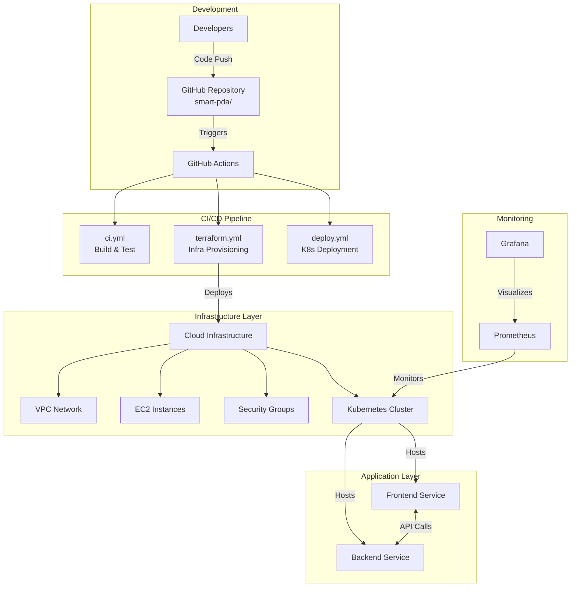
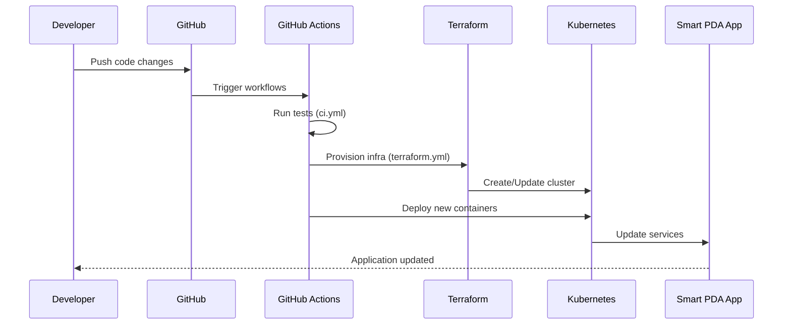

# RUACH: Smart PDA (Personal Digital Assistant)

## 📋 Table of Contents
- [Overview](#overview)
- [Architecture](#architecture)
- [Deployment](#deployment)
- [Development](#development)

## 🚀 Overview

RUACH Smart PDA is an intelligent personal assistant system with cloud-native architecture.

## 🏗️ Architecture

### High-Level System Architecture



### Component Interaction Flow



## 📁 Project Structure

```
smart-pda/
├── .github/
│   └── workflows/
│       ├── ci.yml
│       ├── terraform.yml
│       └── deploy.yml
├── infra/
├── src/
├── docker/
├── scripts/
├── monitoring/
└── README.md
```

## 🛠️ Development

### Prerequisites
- Docker
- Kubernetes
- Terraform

### Local Setup
```bash
# Clone repository
git clone https://github.com/Jedidiah/Cloud_DevOps_Project.git
cd Cloud_DevOps_Project

# Start development environment
docker-compose up
```

## 📊 Monitoring
- **Prometheus**: Metrics collection
- **Grafana**: Dashboards at http://localhost:3000
- **Alerts**: Configured in `monitoring/alerts/`

## 📄 License
MIT License - see LICENSE file for details
## Setup Instructions
## CI/CD Pipeline Explanation
## Monitoring Screenshots
## Lessons Learned

